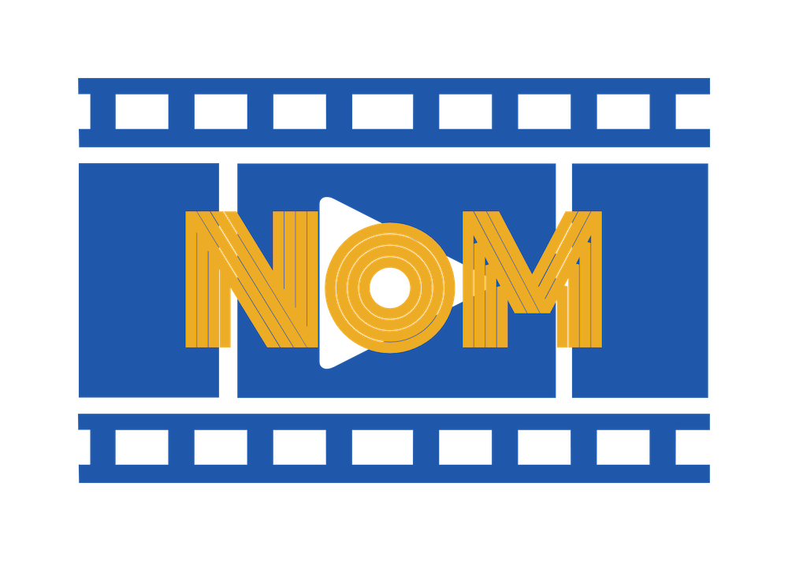

# 

## サイト概要
NoM <言語学習用映画 紹介,情報共有アプリ>  
映画を使って語学を勉強する人向けのアプリ。  
APIを使って映画の情報を取得し、学習者が映画に対し、評価,コメント,お気に入り登録などができる。  
また、学習者自身の学習tipsや雑談も記事として投稿し共有できる。  
目的の言語、ジャンルで検索ができる。  
Vision AIを使った、出演者作品のオススメ、Safe Searchや、Natural Languageを使った内容のキーワード検索も追加予定。  

### サイトテーマ
利用者に学習時間を削らせず、良い教材に出会う。  
情報共有を促し、学習へのモチベーションアップ。

### テーマを選んだ理由
現在、語学を勉強中であり、映画を見て勉強することに効果を感じている。また、同じ方法で学習する人も多くいると感じている。
しかし、既存の検索サイトでは語学学習に特化しておらず、自分の好みの教材を探すことに時間をとられたり、見つけた教材が学習に適していなかったということがよくある。  
また以前、英語以外の勉強もしていたが、周りにその言語の学習者がおらず、良い教材が見つからなかった。
このような実体験からこのテーマを選んだ。  

### ターゲットユーザ
すべての言語学習者。  

### 主な利用シーン
学習者が新しく教材となる映画を探す場合。  

## 設計書
https://docs.google.com/spreadsheets/d/1YbYjzuFkO22YOKPoJp9PFmRody3KhoPrw3GsVWcmwMI/edit?usp=sharing
### 機能一覧
https://docs.google.com/spreadsheets/d/16fCEKimM3ANY7GSoARds0D2VP4XWf-RrxUF1g7mwsXs/edit?usp=sharing
